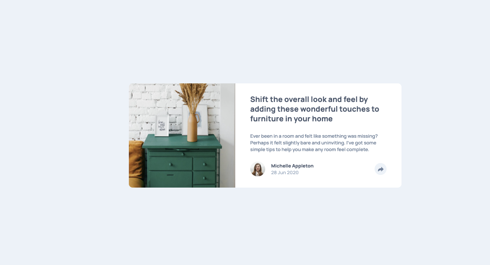

# Frontend Mentor - Article preview component solution

This is a solution to the [Article preview component challenge on Frontend Mentor](https://www.frontendmentor.io/challenges/article-preview-component-dYBN_pYFT).

## Overview

### The challenge

Users should be able to:

- View the optimal layout for the component depending on their device's screen size
- See the social media share links when they click the share icon

### Screenshot

### Links

- Live Site URL: [Check](https://portfolio-frontend-l78x.vercel.app/)

## My process

### Built with

- Designed by Figma
- Semantic HTML5 markup
- CSS custom properties
- Flexbox
- Resiponsive design
- [React](https://reactjs.org/) - JS library

### What I Learned

1. **Responsive Design Workflow** - Strengthened responsive web design skills by translating Figma designs into CSS, using Chrome DevTools to fine-tune layouts across breakpoints.

2. **Dynamic Button States** - Implemented toggle functionality using conditional className and CSS to switch button styles based on state: `className={`share-button ${isShareOpen ? "active" : ""}`}`.

3. **React State for Interactive UI** - Used `useState` with conditional rendering (`{isShareOpen && (...)}`) to show/hide content on button click.

4. **Icon Color Inversion** - Applied `filter: brightness(0) invert(1)` to dynamically invert icon colors for active states.

## Author

- Website - [Click here](https://my-portfolio-frontend-kappa-lemon.vercel.app/)
- Frontend Mentor - [Click here](https://www.frontendmentor.io/profile/JoshLiu111)
