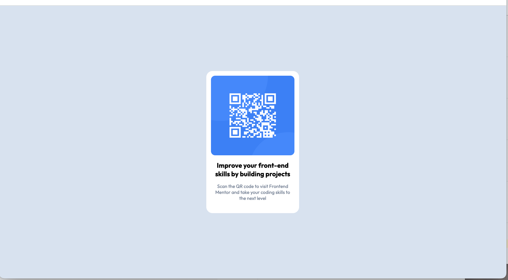

# Frontend Mentor – QR Code Component Solution

This is my solution to the [QR code component challenge on Frontend Mentor](https://www.frontendmentor.io/challenges/qr-code-component-iux_sIO_H).

## Table of contents

- [Overview](#overview)

  - [Screenshot](#screenshot)
  - [Links](#links)

- [My process](#my-process)

  - [Built with](#built-with)
  - [What I learned](#what-i-learned)
  - [Continued development](#continued-development)
  - [Useful resources](#useful-resources)

- [Author](#author)

## Overview

### Screenshot



### Links

- Solution URL: [Add solution URL here](https://your-solution-url.com)
- Live Site URL: [Add live site URL here](https://your-live-site-url.com)

## My process

### Built with

- Semantic HTML5 markup
- CSS custom properties
- Flexbox
- Mobile-first workflow
- [React](https://reactjs.org/) – JavaScript library

### What I learned

- How to use React to build a reusable QR code card component using JSX.
- How to structure a simple UI component with clear separation between markup and styling.

```javascript
const QRCard = () => {
  return (
    <div className="qr-card">
      
      <h3 className="qr-card-title">
        Improve your front-end skills by building projects
      </h3>
      <p className="qr-card-description">
        Scan the QR code to visit Frontend Mentor and take your coding skills to
        the next level
      </p>
    </div>
  );
};

export default QRCard;
```

- How to use basic CSS to closely match the provided design, focusing on spacing, typography, and border radius.

```css
.qr-card {
  border-radius: 12px;
  width: 179px;
  height: 274px;
  padding: 9px;
  background-color: white;
  text-align: center;
}

.qr-card-img {
  width: 100%;
  height: 60%;
  border-radius: 8px;
}

.qr-card-title {
  font-family: "Outfit", system-ui, -apple-system, BlinkMacSystemFont, sans-serif;
  font-size: 0.8rem;
  font-weight: 700;
  margin: 7px;
}

.qr-card-description {
  font-family: "Outfit", system-ui, -apple-system, BlinkMacSystemFont, sans-serif;
  font-size: 9px;
  padding: 0 5px;
  margin-top: 10px;
  color: var(--description);
  font-weight: 400;
}
```

### Continued development

- Add a button to regenerate the QR code dynamically.
- Improve responsiveness and accessibility for a wider range of screen sizes.

### Useful resources

- [React documentation](https://react.dev/learn) – This helped me understand the fundamentals of React and component-based development.

## Author

- Website – [Josh Liu](https://my-portfolio-frontend-kappa-lemon.vercel.app/)
- Frontend Mentor – [@JoshLiu111](https://www.frontendmentor.io/profile/JoshLiu111)
